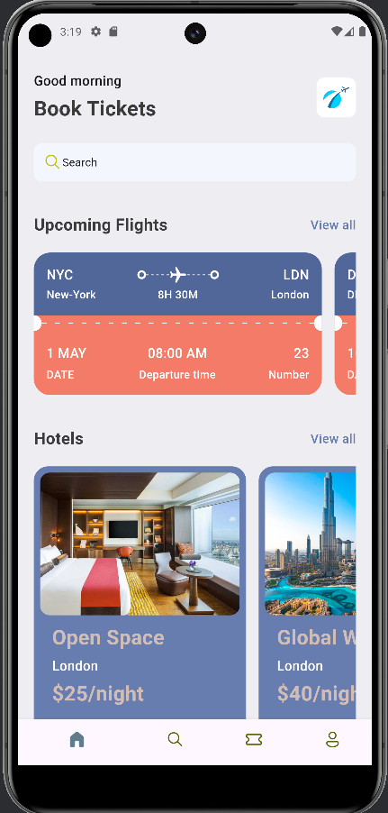
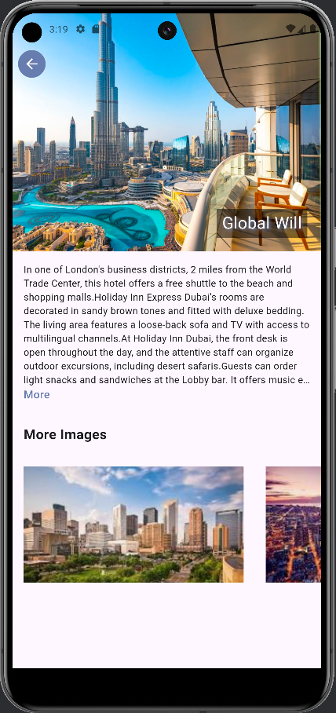

# Ticket-App

## Introduction
Ticket-App is a comprehensive ticketing application developed using Flutter and Dart. This project demonstrates advanced UI design, state management, and smooth navigation. The app features various screens including home, search, ticket details, and profile, with interactive UI animations and seamless transitions.

## Screenshots

  

    
  

  

    
  

## Features
- **Complex UI Components**: Implementation of stateful and stateless widgets and reusable widgets.
- **State Management**: Integration of GetX, BLoC, and Riverpod for efficient state management.
- **Routing and Navigation**: Detailed navigation and routing mechanisms for a smooth user experience.
- **Advanced UI**: Search screens, ticket detail views, and profile pages with interactive animations.
- **Cross-Platform**: Focused on Android and iOS mobile apps, with potential for web and desktop support.

## Usage
- **Home Screen**: Displays a list of available tickets.
- **Search Screen**: Allows users to search for specific tickets.
- **Ticket Details**: Provides detailed information about the selected ticket.
- **Profile Page**: Shows user profile information.

## State Management
Implemented GetX, BLoC, and Riverpod for managing app state.

## Contribution
1. Fork the repository.
2. Create a new branch (`git checkout -b feature-branch`).
3. Commit your changes (`git commit -m 'Add some feature'`).
4. Push to the branch (`git push origin feature-branch`).
5. Open a pull request.

## License
This project is licensed under the Apache-2.0 license.

## Acknowledgements
Special thanks to the Flutter community and the creators of the state management solutions used in this project.
